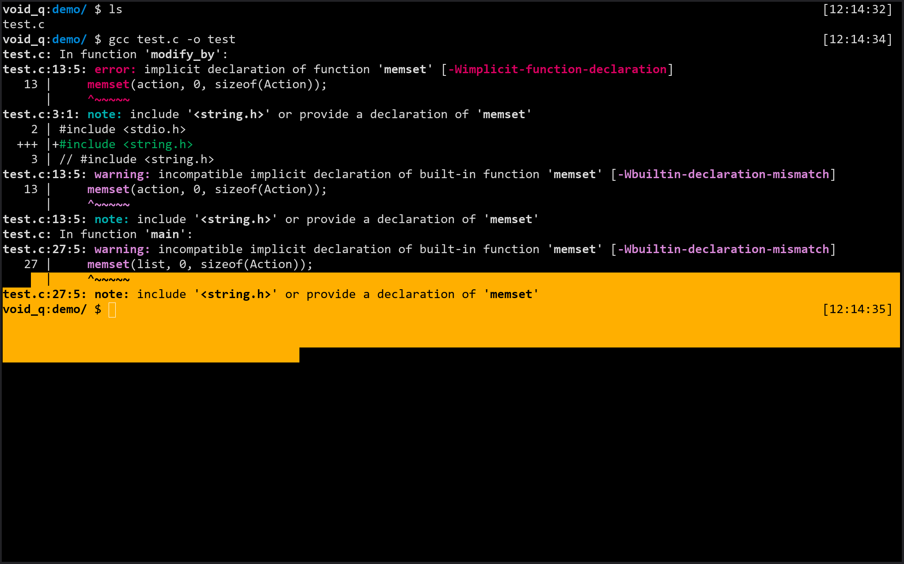

# quiet-dark.ghostty

A Ghostty terminal theme based on [quiet.vim](https://github.com/vim/colorschemes/blob/master/colors/quiet.vim) by [Maxence Weynans](https://github.com/neutaaaaan).

## Preview



## Install
```sh
mkdir -p ~/.config/ghostty/themes
curl -o ~/.config/ghostty/themes/quiet-dark https://raw.githubusercontent.com/cincip/quiet-ghostty/main/quiet-dark
```

Then add to `~/.config/ghostty/config`:
theme = quiet-dark

## Credits

Shout out to [Maxence Weynans](https://github.com/neutaaaaan) for the original theme.
